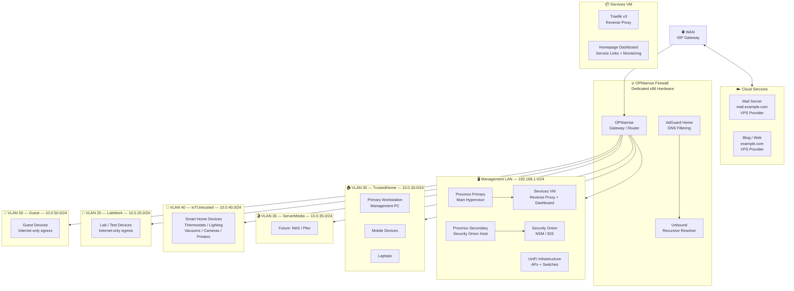

# Home Lab Network Topology

**Last Updated:** 2026-02  
**Status:** Active

A reference document covering the network architecture of my home lab, including segmentation strategy, VLAN layout, key services, and firewall philosophy.

---

## Network Diagram



---

## Hardware Overview

| Device | Role | Notes |
|--------|------|-------|
| Dedicated x86 Mini PC | OPNsense Firewall | Baremetal, no VMs |
| Mini PC (Primary) | Proxmox Hypervisor | Main workloads |
| Mini PC (Secondary) | Proxmox Hypervisor | Security monitoring |

---

## VLAN Layout

| VLAN | Name | Subnet | DHCP Range | Purpose |
|------|------|--------|------------|---------|
| — | Management LAN | 192.168.1.0/24 | .10–.245 | Infrastructure only — no user devices |
| 20 | LabWork | 10.0.20.0/24 | .100–.199 | Lab/testing — internet egress only |
| 30 | TrustedHome | 10.0.30.0/24 | .100–.199 | Trusted personal devices |
| 35 | ServerMedia | 10.0.35.0/24 | .100–.199 | Media services (future expansion) |
| 40 | IoTUntrusted | 10.0.40.0/24 | .100–.199 | Smart home / IoT — fully isolated |
| 50 | Guest | 10.0.50.0/24 | .100–.199 | Guest devices — internet only |

> **Note:** VLANs 1 and 99 are defunct. UniFi infrastructure requires 192.168.x for management — keep this in mind when planning VLAN numbering with Ubiquiti gear.

---

## DNS Architecture

```
Client Query
    ↓
AdGuard Home
    ↓ Ad/tracker blocking + query logging
Unbound (recursive resolver)
    ↓ DNSSEC validation
Quad9 DoH — upstream fallback
```

**Why this stack:**
- AdGuard Home handles filtering and gives visibility into DNS queries per device
- Unbound does recursive resolution locally — avoids sending all queries to a single upstream
- Quad9 as fallback for resilience and privacy (no logging, malware blocking)

---

## Services VM

Runs on the Management LAN. Houses core infrastructure services behind a reverse proxy.

| Service | Role |
|---------|------|
| Traefik v3 | Reverse proxy with automatic service discovery via Docker labels |
| Homepage | Self-hosted dashboard — service links, status, monitoring widgets |

Traefik handles routing for all services via Docker labels — no manual config per service after initial setup.

---

## Firewall Philosophy

This network operates on a **default deny** model. Nothing is permitted unless explicitly allowed.

**Core principles:**

**Management separation** — All infrastructure (hypervisors, firewall, DNS, monitoring) lives on a dedicated Management LAN with no user or IoT devices. Access from user VLANs to management is restricted to a single designated workstation.

**RFC1918 blocking** — Every VLAN has an explicit block rule for RFC1918 (private) address space before internet access is permitted. This prevents lateral movement between VLANs even if a device is compromised.

**Egress control** — VLANs like LabWork and Guest can reach the internet but cannot reach any internal resources. IoT devices are similarly isolated, with additional specific rules where vendor requirements demand exceptions (e.g., camera P2P traffic).

**Explicit host rules over subnet rules** — Where possible, rules target specific source/destination IPs rather than entire subnets. The management workstation is the clearest example — it has named rules granting access to Proxmox, Security Onion, and the firewall admin interface, while the rest of TrustedHome does not.

**Alias-driven rule management** — Port groups and host groups are defined as aliases and referenced in rules. This makes rules readable and changes easier — update the alias, all rules using it update automatically.

---

## IoT Segmentation Notes

IoT devices (VLAN 40) get internet access but are blocked from all internal networks. A few specific exceptions exist for devices with unusual networking requirements, but each exception is documented and port-limited.

Smart home orchestration is handled through HomeKit where possible, keeping local control without cloud dependency. Devices that require cloud access are allowed outbound but cannot initiate connections to anything internal.

---

*Tags: networking, infrastructure, homelab, opnsense, vlans, firewall*
